# Proyecto-con-Amazon-Athena
# Manual de Uso: Amazon Athena con Datos de egresados de Canarias

Este manual documenta el proceso seguido para investigar la herramienta Athena del ecosistema de análisis de datos de AWS, explicar su funcionamiento y utilizarla para trabajar con un conjunto de datos real.

## 1. Subida de datos a Amazon S3
Primero, descargamos el dataset del portal del Gobierno de Canarias en formato CSV.
Creamos un bucket en S3 llamado `datos-egresados` y subimos nuestro archivo. Este bucket actuará como repositorio de almacenamiento.
Es recomendable crear una carpeta extra donde guardaremos los datos virgenes, ya que esta herramienta guarda los datos en la carpeta origen, por lo que con la carpeta permitiremos que los datos se mantengan intactos y de esta manera no ocasionen problemas en las consultas.

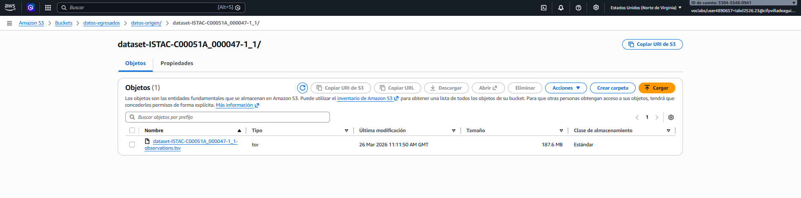

## 2. Configuración de la base de datos en Athena
Antes de nada le debemos indicar donde queremos que se guarden los resultados, por lo que entramos en Amazon Athena.
Abrimos esta pestaña y le damos a `administrar`:
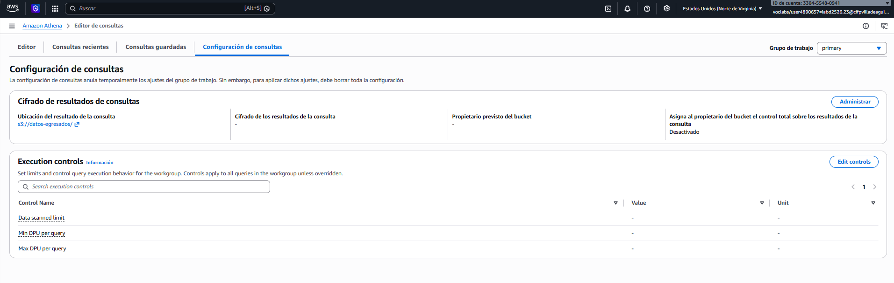
### Y le indicamos la ruta exacta de nuestro S3
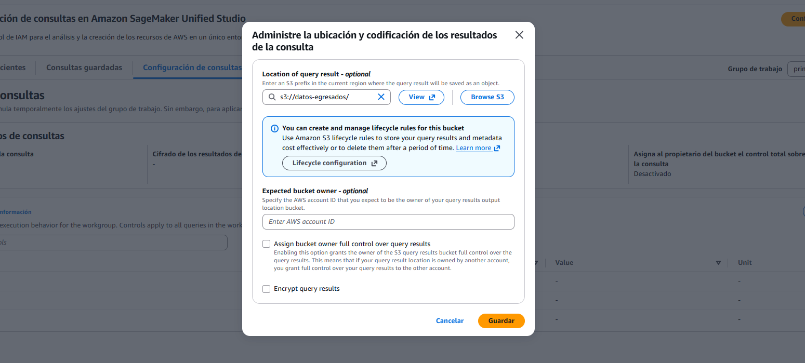

### Creamos la BBDD de la manera más sencilla 
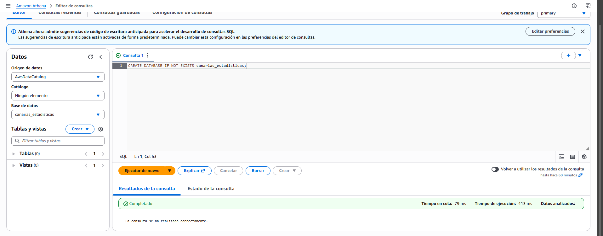

### Le damos a crear tabla a partir de los datos del S3.
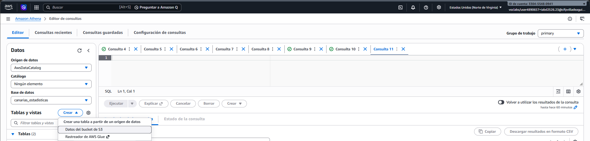

### Le indicamos el nombre de la tabla que queremos crear y le decimos que la cree en la BBDD que ya habiamos creado antes.
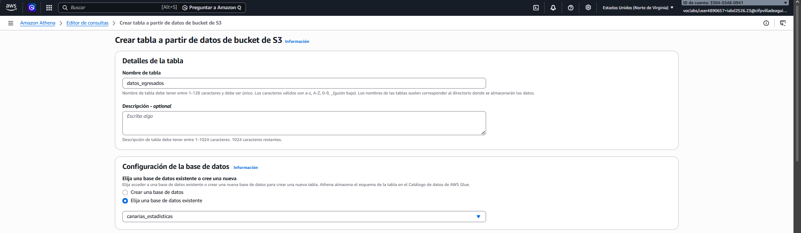

### Ponemos donde se encuentran los datos en nuestro S3
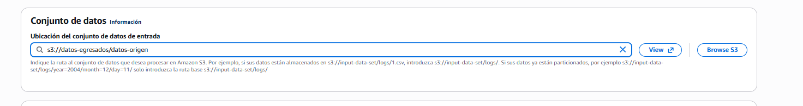

### Cambiamos el formato del archivo para indicarle que es un .tsv
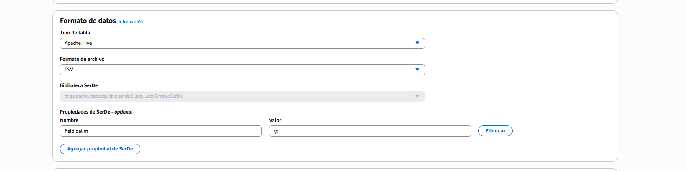

### Agregamos las columnas y el tipo
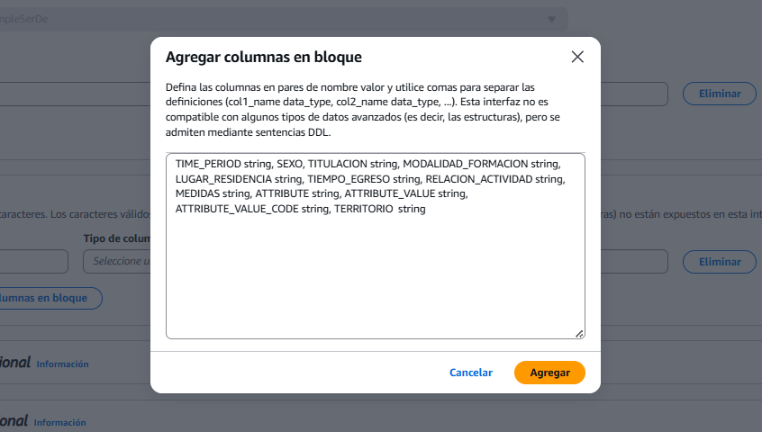

### Revisamos por si fallamos en algo, si esta todo bien continuamos
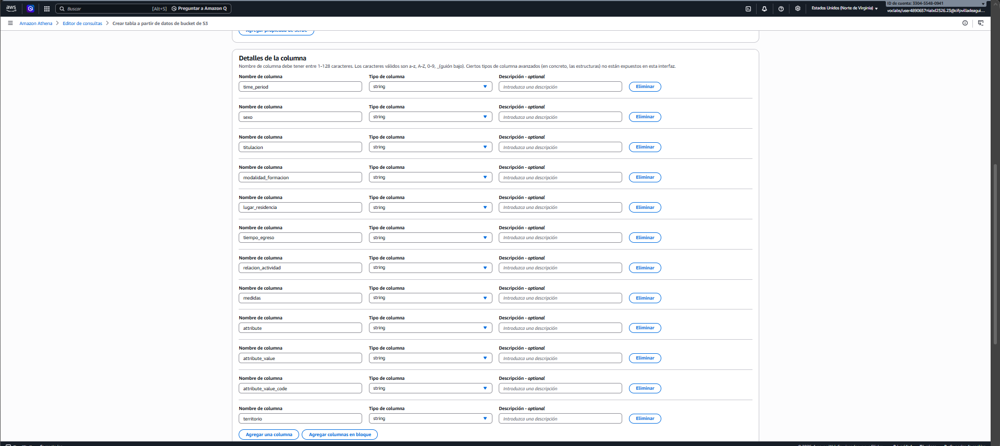

### Si lo hemos hecho bien, nos aparecerá el código de nuestra tabla y ya le damos a crear la tabla.
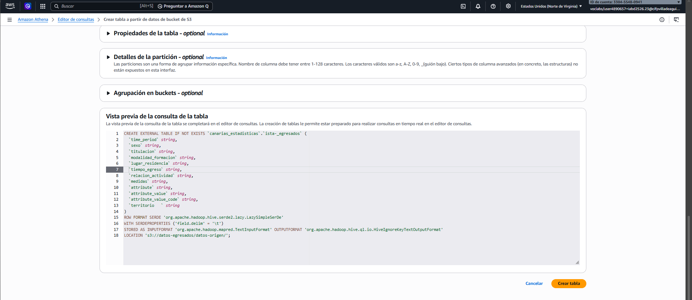

```
CREATE EXTERNAL TABLE IF NOT EXISTS `canarias_estadisticas`.`ISTAC_egresados` (
  `time_period` string,
  `sexo` string,
  `titulacion` string,
  `modalidad_formacion` string,
  `lugar_residencia` string,
  `tiempo_egreso` string,
  `relacion_actividad` string,
  `medidas` string,
  `attribute` string,
  `attribute_value` string,
  `attribute_value_code` string,
  `territorio` string
)
ROW FORMAT SERDE 'org.apache.hadoop.hive.serde2.lazy.LazySimpleSerDe'
WITH SERDEPROPERTIES ('field.delim' = '\t')
STORED AS INPUTFORMAT 'org.apache.hadoop.mapred.TextInputFormat' OUTPUTFORMAT 'org.apache.hadoop.hive.ql.io.HiveIgnoreKeyTextOutputFormat'
LOCATION 's3://datos-egresados/datos-origen/dataset-ISTAC-C00051A_000047-1_1/'
TBLPROPERTIES ('skip.header.line.count'='1'); #esta linea la añadimos para que no se repitan los titulos de las columns
```

### Ejecutamos el script
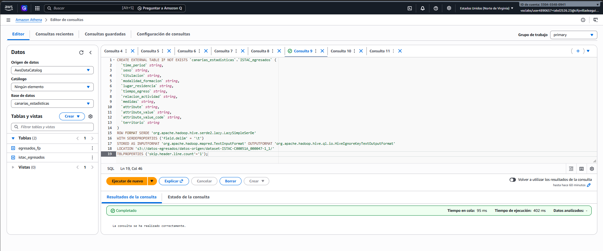

### Hacemos un `select * ` para comprobar que efetivamente los datos están
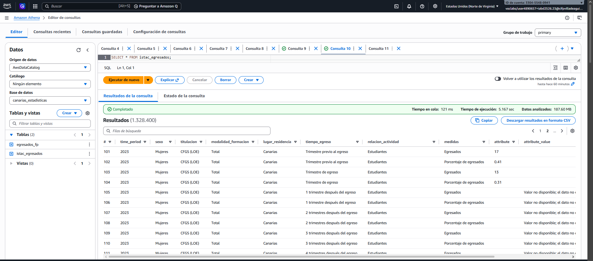

## 3. Análisis de datos con la herramienta Athena
### ¿A qué se dedican los graduados?

Esta consulta te permite saber cuántos de esos egresados han seguido estudiando, cuántos están trabajando o en otras situaciones
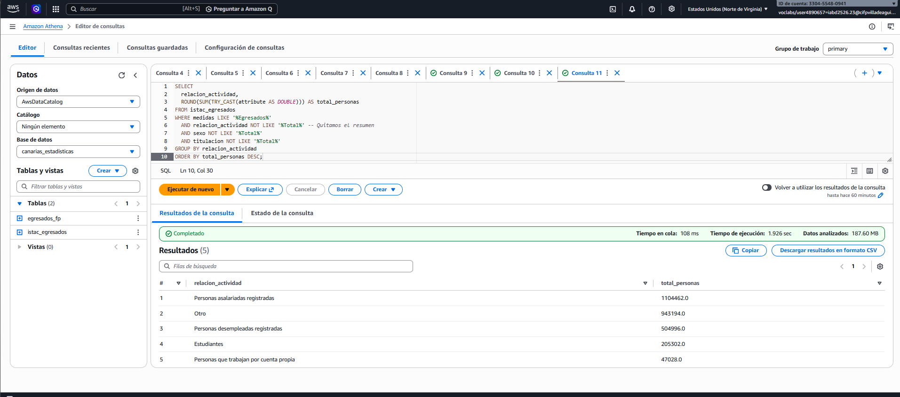

```
SELECT 
  relacion_actividad, 
  ROUND(SUM(TRY_CAST(attribute AS DOUBLE))) AS total_personas
FROM istac_egresados
WHERE medidas LIKE '%Egresados%' 
  AND relacion_actividad NOT LIKE '%Total%' -- Quitamos el resumen
  AND sexo NOT LIKE '%Total%'
  AND titulacion NOT LIKE '%Total%'
GROUP BY relacion_actividad
ORDER BY total_personas DESC;
```

### ¿En qué momento se recogen los datos?

Esta consulta nos permite ver cuántos datos hay de gente recién graduada vs gente que se graduó hace 5 años
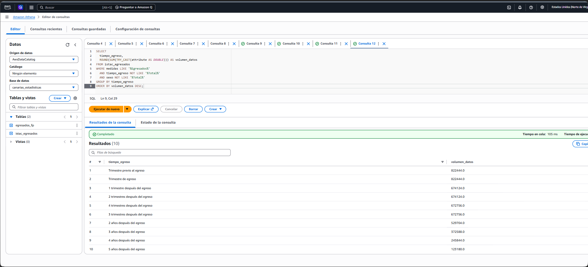
```
SELECT 
  tiempo_egreso, 
  ROUND(SUM(TRY_CAST(attribute AS DOUBLE))) AS volumen_datos
FROM istac_egresados
WHERE medidas LIKE '%Egresados%' 
  AND tiempo_egreso NOT LIKE '%Total%'
  AND sexo NOT LIKE '%Total%'
GROUP BY tiempo_egreso
ORDER BY volumen_datos DESC;
```
### Comparativa por Sexo

En esta consulta separamos y analizamos el número de graduados por género para cada familia profesional, eliminando los datos duplicados y los porcentajes para obtener una comparativa real de hombres y mujeres.
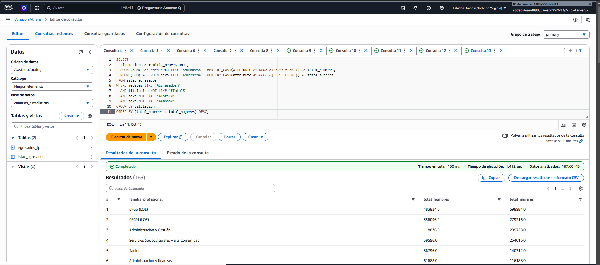
```
SELECT 
  titulacion AS familia_profesional,
  ROUND(SUM(CASE WHEN sexo LIKE '%Hombres%' THEN TRY_CAST(attribute AS DOUBLE) ELSE 0 END)) AS total_hombres,
  ROUND(SUM(CASE WHEN sexo LIKE '%Mujeres%' THEN TRY_CAST(attribute AS DOUBLE) ELSE 0 END)) AS total_mujeres
FROM istac_egresados
WHERE medidas LIKE '%Egresados%' 
  AND titulacion NOT LIKE '%Total%' 
  AND sexo NOT LIKE '%Total%'
  AND sexo NOT LIKE '%Ambos%'
GROUP BY titulacion
ORDER BY (total_hombres + total_mujeres) DESC;
```
### Revisión de los resultados
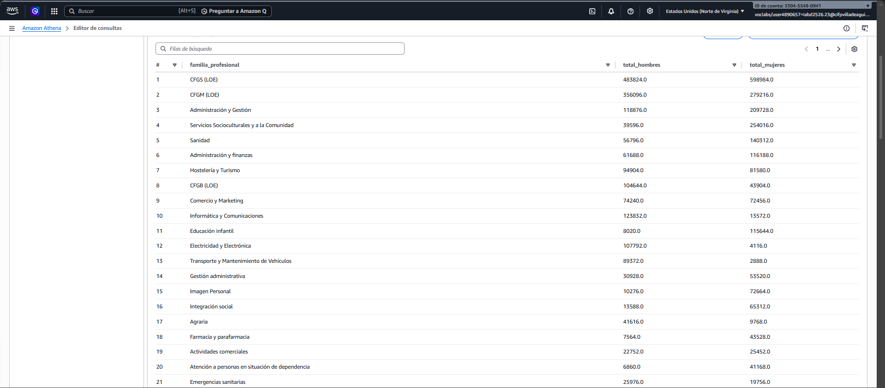

### Comprobamos que las modalidades son Presencial y No presencial, aunque aparezca total
"El archivo original contiene filas agregadas (Totales) para facilitar la lectura manual, pero para el análisis en Athena las he filtrado para evitar duplicidades y asegurar la integridad de los cálculos".
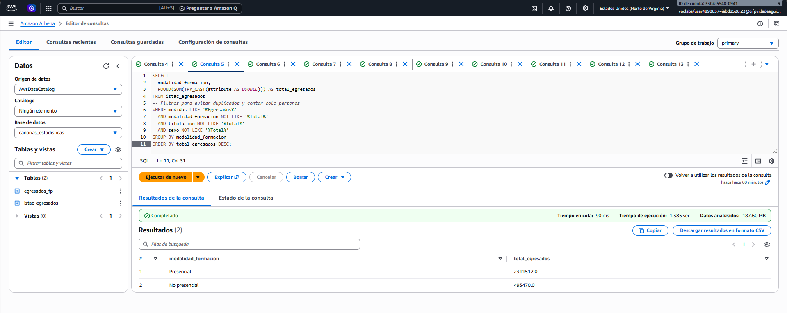
